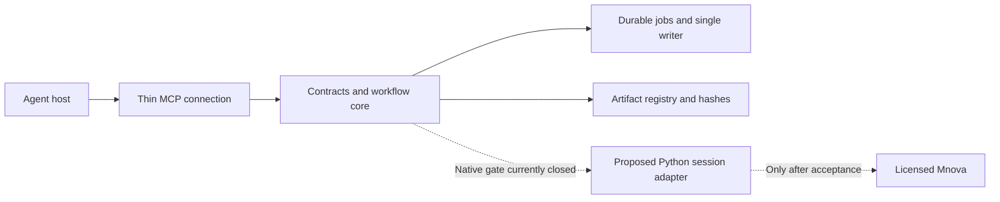

# Assessment and next technical route

Status: **R0 IMPLEMENTED AND FAILED; R1 NOT RUN**.
Date: 2026-09-15. Shared baseline: Chembridge 2026-09-14.1.

The original review delivered the requested icon, installation, assessment and
technical plan, then stopped before coding. The user subsequently approved the
next implementation phase. Its bounded R0/R1 harness is now implemented, but the
first session-creation experiment failed before sentinel ownership was established.
See the [R0 result and current decision](SESSION_LIFECYCLE_R0.md). Native writes
remain disabled and the R1 close experiment was not run.

## 1. Current assessment

The portable core is a useful foundation; the native scientific product remains
incomplete. Six discoverable tools do not imply six accepted scientific workflows.

| Area | Current result | Decision |
| --- | --- | --- |
| Icon and local host wiring | READY on this device | Original icon installed and hash-checked; personal plugin installed/enabled; non-editable runtime verified from outside the checkout. |
| Portable contracts/files/jobs | READY within tested scope | Existing Windows/Ubuntu CI passed; six installed MCP calls validated. Preserve this core. |
| Scientific processing | BLOCKED | No accepted raw-data import, processing, integrals, save/reopen or export. Keep native writes disabled. |
| Native lifetime | R0 FAILED / R1 NOT RUN | Old cross-language cleanup failed; the subsequent Python session-creation candidate also failed before ownership was established. Its temporary JS dirty observer is read-only. |
| Cloud implementation checks | READY at the checked core revision | Existing browser-account switching restored the original environment without new credentials or a duplicate. Exact e861d52 checkout: 52 tests passed, 4 Windows-only skips, contracts/stdio/source checks passed; configuration restoration is recorded separately in CLOUD_SETUP.md. |
| Ordinary-user distribution | PARTIAL | Current device runs without a source checkout; the private venv still needs its existing Python base. No standalone installer, update/removal or clean-device acceptance. |
| Hosts, models and delivery | UNVERIFIED beyond direct local protocol | No new-task model call, Terra max workflow, remote adapter or received native artifact is accepted. |

### Repairs completed before R0 implementation

1. Added and installed the previously missing icon.
2. Added the local MCP connection and a private non-editable runtime, replacing
   the earlier source-only state. The observed personal-source path mismatch
   during installation was corrected without changing existing plugin entries.
3. Restored the original cloud environment through an existing signed-in account
   and ran actual portable checks at e861d52. The earlier empty environment list
   alone did not prove account identity; successful switching and environment
   readback established the working route. No credentials or duplicate environment
   were needed. See [cloud evidence](CLOUD_SETUP.md).

The original native crash has **not** been repaired. A newly implemented session
candidate was tested after approval and produced a separate creation-stage crash.
The executed source and unresolved intent are retained privately; both production
and acceptance mutation entrypoints are disabled. This is containment, not a
confirmed lifetime repair.

## 2. Root-cause hypothesis and evidence boundary

The private failed experiment released Python references to a standalone
document and its children, ran garbage collection, and subsequently accessed a
retained JavaScript wrapper. Reading the UUID guard already dereferences the
underlying native object. A stale wrapper or duplicate destruction is therefore
the leading hypothesis; the Windows `c0000409` event does not distinguish them.

[pybind11's ownership documentation](https://pybind11.readthedocs.io/en/stable/advanced/functions.html#return-value-policies)
explains that object destruction depends on the binding return-value policy.
The installed Mnova documentation exposes no policy for these bindings. A
pybind11 type name, `del`, or `gc.collect()` is insufficient evidence of safe
native ownership. This is an integration hypothesis, not a confirmed vendor bug.

Installed documentation does establish these Python entrypoints:

- `DocumentPlugin.newDocument(aName: str) -> Document`: create a session document.
- `DocumentPlugin.documents()`: enumerate current documents.
- `DocumentPlugin.closeDocument(aDoc: Document) -> None`: close that document.

The documentation does not define close cancellation, dirty-document prompts,
the default blank-document replacement rule or post-close wrapper lifetime.
The JS `Document.isModified` property is read-only. No corresponding Python dirty
setter was found. `MainWindow.setWindowModified` is not a documented substitute
for a specified document's dirty state. Prior content edits returned `false`,
so a merely nonempty sentinel cannot count as unsaved-work protection.

## 3. Selected architecture for the next phase

Retain the host-neutral Python core, six public tools and typed output contracts.
Replace the experimental standalone/cross-language lifetime approach with one
candidate: **session-owned creation and closure through Python**, with a temporary
read-only JS observer for the dirty flag. The first R0 run failed; the route below
remains unaccepted.

The candidate creates an owned document with `newDocument`, records its identity
from fresh inventory, and retains parent references throughout work. It releases
child references while the parent is still live, then uses one
`closeDocument(owned)` call. After closing, it observes only a fresh inventory:
no old document or child wrapper reads, no JS retained handle, no JS `destroy`,
and no second cleanup attempt. The owning function must finish and a later
read-only invocation must succeed before lifecycle acceptance is recorded.

This specifies an experiment, not a proven implementation recipe. Hold writes
disabled until the gates below pass. Do not weaken evidence requirements to make
this preferred route appear successful.

Capture inventory and active selection around creation as well as closure:
`newDocument` must not silently replace an unrelated default document. Unexpected
dialogs, timeout or a missing final receipt leave the native outcome unknown;
they do not authorize force-close, process termination or a second close call.

### Alternative only if the candidate fails

Evaluate an independently isolated Console executor only after verifying its
automation licence, documented invocation, process ownership, no forwarding into
the GUI, output semantics and exit cleanup. The [Console download page](https://mestrelab.com/mnova-console)
establishes availability, not those guarantees. A second launcher PID is not
isolation. Do not adopt a resident service, a second model provider or Gears by
default. Vendor support contact requires separate authorization to send.

## 4. Ordered implementation and acceptance gates

| Stage | Bounded work after approval | Required result before continuing |
| --- | --- | --- |
| R0: Resolve native preconditions — FAILED | Read-only preflight passed; the first session creation failed before ownership was established. No dirty action ran. | Resolve creation execution-context and ownership before a narrower diagnostic. Authentic dirty sentinel remains required; no window-title flag substitute. |
| R1: Pure-Python lifetime experiment | Use only task-owned sentinel and target documents; inventory before/after; close only the target once; let Python scope end; execute a later read-only probe. | Only target disappears; sentinel content, dirty state and active selection survive; no unexpected prompt handling, process failure or late destructor failure. |
| R2: Save and fresh readback | Save a synthetic native result, release it using accepted R1, then load from disk and compare document/spectral semantics. | Nonempty `.mnova`, hash/size, dimensions, nucleus, points, axes, signal and intended annotations match; editability verified. Save exit alone fails this gate. |
| R3: One 1D vertical workflow | Start with one authorized synthetic/public 1H raw fixture, explicit processing settings, reference and peaks/integrals. Export native document plus PNG/PDF and a table. | Numerical expectations with declared tolerances, unchanged raw bytes, reopen equality, inspected figures and provenance. Add 13C only as a separately checked recipe. |
| R4: Connect accepted workflow to jobs | Add versioned operation payloads and native receipt validation; exact document/revision binding; cooperative cancellation; unknown-outcome reconciliation. | Duplicate request causes one write; crash/timeout retains uncertain lease; cancellation reports actual state; malformed output never triggers replay. |
| R5: Delivery and user packaging | Choose an original-file route for each host, build a standalone runtime package, add input selection/recovery, then test install/update/remove. | Real received bytes and openable native file; clean-device test; existing state preserved; checksums and rollback. Current-device installation does not substitute. |
| R6: Model and scoped release | Run representative requests with actual available Terra max, then other advertised hosts/models. | Record first-attempt success, corrections, calls, elapsed time and available real usage; publish a scoped preview only for passing routes. |

Cloud access restoration and portable checking are now complete for the recorded
core revision. Future implementation changes still need their own actual checkout
and checks; the current branding/documentation update does not change runtime
source. Do not infer native or host-model acceptance from the cloud result.

At R3, record any processing that Mnova performs during import before applying
the requested recipe. Distinguish raw FID from already processed data and avoid
applying the same transform or correction twice. Retain explicit units and
reference assumptions; unavailable solvent or calibration remains unknown.

## 5. Concrete boundaries for the next coding task

Expected edits initially belong only to the native adapter/acceptance harness,
its focused tests and native evidence. Do not broaden the public tool catalog,
turn on all four planned `mnova_run` operations, build a hosted relay, or implement
full packaging while R0/R1 remain unresolved. Each accepted native operation gets
its own typed request/result schema before runtime exposure.

The approved task's deliverable is now the implemented harness, focused guard
tests and [R0 failure/decision record](SESSION_LIFECYCLE_R0.md). The failed result
does not authorize progression to R1 or R2. Estimated durations remain withheld
until native preconditions are resolved.

## 6. Current handoff

R0/R1 development was approved. R0 failed and R1 did not start. Preserve the
creation intent and exact executed source; do not rerun by changing request IDs.
The next diagnostic must first address the missing execution-context and binding
ownership evidence, then separate creation, UUID read and post-create observation
into individual checkpoints. Do not enable save/reopen, scientific operations or
a hosted relay from this result. Earlier cloud and installed-core evidence remains
separate from the new native failure.
