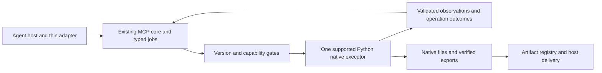

# Assessment and next technical route

Status: **R0 PASSED BOUNDED; R1 FAILED; NATIVE WRITES DISABLED**.
Date: 2026-09-16. Shared baseline: Chembridge 2026-09-14.1.

Current route: **C3; P0 PORTABLE IMPLEMENTATION APPROVED**. The owner confirmed
the hub's C3 architecture after offline F analysis. [P0](P0_EXECUTION.md) implements
the portable execution boundary with fake effects; native experiments and writes
remain disabled. The C1 assessment below is retained as historical research,
including unresolved native contracts; its next-step order is superseded by C3/P0
and the [current status](STATUS.md).

The user approved development after the icon, installation and architecture
review. The previous implementation phase repaired zero-page observation,
established a visible owned synthetic document with genuine dirty state,
and ran one bounded target-close
experiment. That sequence removed the protected synthetic sentinel while leaving
the intended target present. Independent readback confirmed the failure. All
native writes stopped; the close route now has its own disabled gate.

## 1. Current assessment

| Area | Current result | Decision |
| --- | --- | --- |
| Icon and local host wiring | READY on this device | Icon, enabled personal plugin and non-editable runtime were verified independently of the checkout. Preserve the installed core. |
| Portable contracts/files/jobs | READY within tested scope | Six typed tools, durable jobs and staging/artifact checks remain useful infrastructure. Tests do not prove native workflows. |
| Native R0 prerequisites | PASSED BOUNDED | Main-window creation, unique ownership, synthetic attachment and a true dirty edit passed separate readback on the tested build. |
| Native lifetime R1 | FAILED | Clean target creation passed; the close sequence did not remove the target and the protected synthetic sentinel disappeared. Keep all native writes and the dedicated close path disabled. |
| Scientific workflow R2/R3 | BLOCKED | Native save/reopen, raw-data processing, integrals and exports are not accepted. |
| Cloud implementation checks | READY at recorded revisions | Reuse the existing environment. Record exact checkout results in [cloud evidence](CLOUD_SETUP.md); later code revisions need fresh checks. |
| Ordinary-user distribution | PARTIAL | Current-device installation works without a checkout, but its private venv uses the existing Python base. No general installer, update/removal or clean-device acceptance. |
| Hosts, models and delivery | UNVERIFIED beyond direct local protocol | No new host-model workflow, Terra max benchmark, remote adapter or received native artifact is accepted. |

The original cloud environment was restored through an existing signed-in
account without a duplicate or new credentials. Its actual setup tests and the
GitHub CI runs are separate from native Mnova acceptance.

## 2. Native evidence and unresolved cause

The [original cross-language experiment](NATIVE_API.md) failed with Windows
`c0000409` while a retained JS wrapper could outlive Python references. Stale
wrappers or destruction ownership remain hypotheses. The later [session
diagnosis](SESSION_DIAGNOSTIC_20260916.md) separately identified a null canvas
getter; a zero-page observation guard allowed session creation and readback.
Neither result establishes general safe lifetime semantics.

Assigning an existing session document to `Framework.activeDocument` returned as
a no-op. A distinct documented `action_File_New` main-window action then created
one visible document; ownership was claimed only after independent inventory.
A documented page action produced real `isModified=true`, with the owned
synthetic buffer unchanged. This is the bounded R0 pass.

In [R1](SESSION_LIFECYCLE_R1.md), the disposable target was independently verified
as clean, single-page and empty. The protected sentinel was genuinely dirty.
After the target-close sequence, the sentinel was absent and the target remained.
All three original document rows and the older synthetic buffer were preserved.
Only task-generated synthetic/blank documents were experiment inputs.

The strict failure interval starts at the last values sampled by the preceding
observer and its scope cleanup. It includes target resolution and wrapper
enumeration/release, `closeDocument(target)`, clearing the target reference and
fresh observation. The snapshots mix sequential JS/Python reads and are not
atomic. Their saved values do not prove that scope cleanup had no side effects.
There was no independent read isolating those steps. Do not conclude that the
close API always closes the active document or that a vendor defect has been
proven. The postcondition detected the failed protection; it did not prevent
removal. No native retry or cleanup followed it. See the updated
[interface and failure assessment](INTERFACE_CONTRACT_REVIEW.md).

The installed documentation declares `newDocument`, `documents` and
`closeDocument(aDoc)`, but does not settle Python wrapper return-value ownership,
window/session relationships, dirty-document prompt behavior or post-close
lifetime. [pybind11 ownership documentation](https://pybind11.readthedocs.io/en/stable/advanced/functions.html#return-value-policies)
explains why the binding's actual policy matters. A type name, `del` or
`gc.collect()` is insufficient evidence of a safe native destruction path.

## 3. Architecture and immediate containment

Retain the host-neutral Python core, six public tools, structured result schemas,
durable jobs, artifact hashes and thin host adapters. The native dispatcher stays
closed. The acceptance harness remains outside the installed wheel.

`MUTATIONS_ENABLED=False` disables shipped mutations. A second
`TARGET_CLOSE_ENABLED=False` gate rejects close at both acceptance entrypoints
before native imports or request claims, even if the first flag is privately
enabled. Tests using vendor doubles explicitly opt in both flags only to verify
historical guards, failure receipts and same/new-ID replay refusal. They cannot
accept the failed native route.

Keep failed intents, ownership records, snapshots and exact executed source.
The per-operation intent is flushed and fsynced; progress-stage JSON is atomically
replaced but is not separately fsynced. Do not describe every progress marker as
power-loss durable. No automatic cleanup is authorized by a failed postcondition.

## 4. Candidate route C1

### 4.1 Architecture decision proposed for confirmation

Keep the existing Python core and thin host adapters. Prefer a supported Python
native adapter. Select its execution environment only after lifecycle and
isolation contracts can be stated for an exact build. Native handles stay inside
their documented scope; the core receives validated scalar observations,
operation outcomes and materialized artifacts. A UUID identifies a document but
does not confer memory ownership or prove a GUI window exists.

This describes component responsibilities, not implemented native capabilities.
No public tools, resident service, hosted relay or model provider are added in
this phase. The six existing tools and structured result contracts remain the
public boundary.

### 4.2 Executor selection and difficulty

| Candidate | Assessment | Selection prerequisite |
| --- | --- | --- |
| A: Python adapter with supported GUI document/window lifecycle | Preferred continuation of bounded R0 evidence; high uncertainty in target mapping and wrapper lifetime. | Version-specific ownership, exact-target close/cancel/completion, safe observation and a proven isolated diagnostic environment. |
| B: standalone NMR Python or Console worker | Conditional alternative if it supports editable native artifacts; very high discovery and integration uncertainty. | Actual entrypoint/sample, compatible licence, no GUI forwarding, owned process/configuration, outputs and exit cleanup. Product availability is insufficient. |
| C: legacy JS window bridge | Narrow compatibility/diagnostic candidate only; additional cross-language lifetime and maintenance risk. | Vendor-supported scalar boundary and exact lifecycle; independent acceptance. No automatic substitution for the failed close. |

The [official JS manual](https://mestrelab.com/downloads/mnova/manuals/latest/js-overview.html)
marks the engine deprecated and recommends Python. This weighs against a full JS
rewrite. `JSPlugin.evaluate` exposes string results, not a documented native
handle channel. The [GUI command-line description](https://mestrelab.com/downloads/mnova/manuals/latest/js-command-line.html)
describes forwarding into an existing instance; `-w` cannot qualify an executor
as isolated.

Candidates are evaluated, not tried automatically in sequence. If A cannot meet
its contract, evaluate B on documentation before implementing an executor. If
neither has a supported contract, retain the preview and native-write block. Do
not select a route by counting portable tests or by making a visible action work
once. No credible delivery estimate exists before this decision.

### 4.3 Contract closure before implementation

The [interface matrix](INTERFACE_CONTRACT_REVIEW.md) records what was obtained
and what is missing. The [vendor clarification request](VENDOR_INTERFACE_QUESTIONS.md)
asks for four version-scoped groups: object/buffer lifetime; exact document and
window close; safe observation/thread/events; independent execution.

For each answer, record source, applicable build, preconditions, invalidation,
failure/cancel outcome, completion criterion and an example if available.
Distinguish an explicit unsupported operation from an unanswered question.
General pybind11 guidance and an unversioned example cannot fill a Mnova-specific
contract. Private vendor answers are not public documentation unless publication
is authorized.

### 4.4 Future implementation sequence after confirmation

These are proposed work packages; none has begun in this phase.

| Package | Work and deliverable | Exit criterion |
| --- | --- | --- |
| P0: contract and executor decision | Incorporate authoritative answers; select one exact supported lifecycle, observer and executor. | All prerequisites for the selected experiment resolved; scientific/host gaps listed separately. Owner confirms the route. |
| P1: portable evidence model | Extend the developer-only harness with explicit observation phases, process-instance identity, operation state and capability metadata. Keep runtime native dispatch disabled. | Focused tests verify at-most-one invocation, unknown-outcome quarantine, scope ordering and no same/new-ID replay. No native claim. |
| P2: isolated observer qualification | Establish independent session/configuration; start with supported scalar identity reads, then separately qualify page/item and buffer observations. | Observation-only and resolution/release controls preserve protected state through independent post-scope checks. |
| P3: exact-target lifecycle | Create two fresh disposable documents through the same supported route; record window/UUID mapping and genuine dirty sentinel. Run the selected close once under its documented preconditions. | Only target disappears; protected dirty state, data, selection and active context remain; later independent read succeeds without delayed failure. |
| P4: native save and reopen | Use accepted ownership/close paths to create and reopen a native artifact in a fresh accepted session. | File bytes/hash and scientific/annotation state match; editability verified. This is R2, separate from P3. |
| P5: scientific and product integration | One bounded 1D workflow, then typed job dispatch, delivery, installation and host/model checks. | Remaining acceptance gates below pass individually; advertise only passing capabilities. |

P1 is code development and requires the later explicit start instruction. Route
confirmation alone in this planning phase does not start P1. P2/P3 also require
the applicable native prerequisites; development approval does not turn
unresolved technical conditions into a pass.

### 4.5 Minimum native diagnostic gates

1. **G0, contract and isolation:** establish supported thread/entrypoint,
   document/window targeting, parent/alias lifetime and close outcome semantics.
   Verify a distinct process instance and session/configuration with no forwarding
   into the user's open workspace. PID or launcher exit alone is insufficient.
2. **G1, observer controls:** sample only documented safe scalars first. Separate
   getter evaluation, enumeration and scope release. Then qualify richer reads
   and buffer copying while parents remain valid. A successful conversion does
   not establish that a view may outlive its source.
3. **G2, target control:** use fresh task-created fixtures in the accepted
   environment, identical creation routes and explicit identity/window mapping.
   Record active state and any documented lock-stack operations. Do not recover
   unknown lock state using speculative unlocks.
4. **G3, one close:** record pre-call intent, return observation, permitted wrapper
   release and supported completion evidence separately. A None return is not
   completion. Do not install document event listeners until payload, timing and
   cleanup are supported. `processEvents()` is not a passive completion barrier.
5. **G4, independent reconciliation:** after the entire operation scope exits,
   confirm inventory, window presence, protected dirty state, data and selection
   through an accepted independent observer; include a later bounded observation.
   Record residual deferred-event uncertainty honestly.

Observation controls and exact-target close use distinct fresh experiments; they
do not replay the failed request or clean its remaining target. Unchanged digest
checks apply only to sampled content. Python markers or debugger breakpoints may
narrow a sequence without distinguishing C++ destruction inside a call; vendor
instrumentation may still be necessary.

On unexpected removal, conflicting observations, unknown completion, a prompt
outside the supported contract or process failure: quarantine the operation,
retain evidence, disable that route and reconcile using only an accepted safe
observer. No repeat close, active-document switch, re-registration, force close,
garbage-collection workaround, global shutdown or automatic cleanup is a recovery
step. Supported shutdown of a disposable worker is itself a contract to validate.

## 5. Remaining acceptance order

| Stage | Required evidence |
| --- | --- |
| R1 replacement, currently blocked | Only the intended target disappears; protected dirty content and active selection survive; a later independent invocation succeeds without a crash, unexpected prompt handling or late destructor failure. |
| R2 save and fresh reopen | Nonempty native file with hash/size; reopened dimensions, nucleus, points, axes, data and annotations match; editability verified through an accepted lifecycle. |
| R3 one 1D vertical workflow | Authorized synthetic/public 1H fixture, explicit processing/reference/integrals, numerical tolerances, unchanged raw bytes, provenance and inspected native/PNG/PDF/table outputs. Record any automatic processing during import. |
| R4 connect accepted native work to jobs | Versioned typed operations, exact document/revision binding, one write per request, cooperative cancellation and reconciliation of unknown outcomes without replay. |
| R5 delivery and packaging | Host-received original bytes, openable native file, standalone runtime and clean-device install/update/remove preserving existing state and rollback. |
| R6 model and scoped release | Actual available Terra max then other advertised hosts/models; measured first-attempt success, corrections, calls, timing and available usage. Publish only passing routes. |

Do not broaden public operations, build hosted relays or claim scientific
capability while R1 remains failed. Cloud checks, installed-core protocol calls,
native execution, visual review, host attachments and release acceptance remain
separate evidence.
